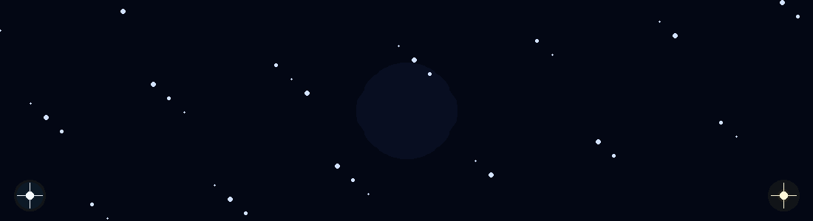
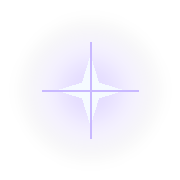
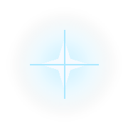
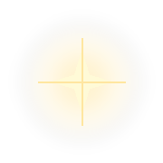
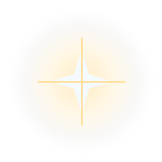
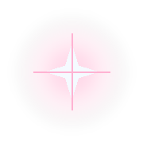

# ✦ SOUHEIL GUELLIL

### `canopus01010011` · Computer Science · Software Engineering · HPC · Computer Vision

**A galaxy of ideas. A constellation of projects. A universe in progress.**

---

## ✦ MY CONSTELLATION

<table>
<tr>
<td align="center">
 
<b>ABOUT</b>
</td>
<td>╲</td>
<td align="center">
 
<b>EDUCATION</b>
</td>
<td>╱</td>
<td align="center">
 
<b>SKILLS</b>
</td>
</tr>
<tr>
<td>╲</td><td>╲</td>
<td align="center">
 
<b>★ CANOPUS</b>
</td>
<td>╱</td><td>╱</td>
</tr>
<tr>
<td align="center">
 
<b>PROJECTS</b>
</td>
<td>╱</td>
<td align="center">
 
<b>GITHUB</b>
</td>
<td>╲</td>
<td align="center">
 
<b>CONNECT</b>
</td>
</tr>
</table>

Each star is a portal to a different part of my journey.

---

## ✦ About Me

I'm a **Computer Science graduate** and currently pursuing a **Master's degree in Software Engineering**.

I enjoy transforming ideas into real-world software:

`IDEA → DESIGN → CODE → TEST → DEPLOY → IMPROVE`

My interests orbit around:

* 🌐 Full-stack web development
* 📱 Mobile development
* 🤖 Artificial Intelligence
* 👁️ Computer Vision
* ☁️ Cloud Computing & DevOps
* 🔐 Cybersecurity
* 🌍 Networking
* ⚡ High-Performance & Distributed Computing
* 🎨 Creative and interactive experiences

<a href="#-my-constellation">↩ Back to constellation</a>

---

## ✦ Education

### 🎓 Master's in Software Engineering

**USTHB · University of Sciences and Technology Houari Boumediene**

Building deeper knowledge in software architecture, large-scale applications, modern development practices, and advanced computing technologies.

### 🎓 Bachelor's in Computer Science

**USTHB · University of Sciences and Technology Houari Boumediene**

Built a foundation in algorithms, programming, databases, networks, software development, and computer systems.

<a href="#-my-constellation">↩ Back to constellation</a>

---

## ★ Canopus

### `CANOPUS01010011`

Canopus is the identity behind this profile.

A constellation is not defined by a single star. It becomes meaningful through the connections between them.

That's how I see my GitHub:

> **Every repository is a star.**
> **Every project tells a story.**
> **Every connection shapes the journey.**

<a href="#-my-constellation">↩ Back to constellation</a>

---

## ✦ Skills & Technologies

### Languages

### Web & Backend

### Data

### Tools & Systems

<a href="#-my-constellation">↩ Back to constellation</a>

---

## ✦ Projects

### 🌌 Canopus Realm

A galaxy-themed hub connecting creative and technical web experiences into one universe.

### 🎤 Karaoke

A modern karaoke experience with search, favourites, a personal library, and a galaxy-inspired visual identity.

### 🤖 AI Hami

An AI-oriented interactive project combining assistance, personalization, and creative features.

### 🚚 ErcTrack

A university team project combining mobile development, a web platform, IoT workflows, and AI-assisted image validation.

### 🎮 Interactive Projects

Games, trackers, utilities, and experimental interfaces built while exploring new technologies and ideas.

**More stars to explore → [View all repositories](https://github.com/canopus01010011?tab=repositories)**

<a href="#-my-constellation">↩ Back to constellation</a>

---

## ✦ GitHub Universe

<a href="#-my-constellation">↩ Back to constellation</a>

---

## ✦ Connect With Me

<a href="#-my-constellation">↩ Back to constellation</a>

---

### ✦ The constellation is only the beginning.

`SOUHEIL · CANOPUS01010011 · CS · SOFTWARE ENGINEERING`

⭐ [github.com/canopus01010011](https://github.com/canopus01010011)

